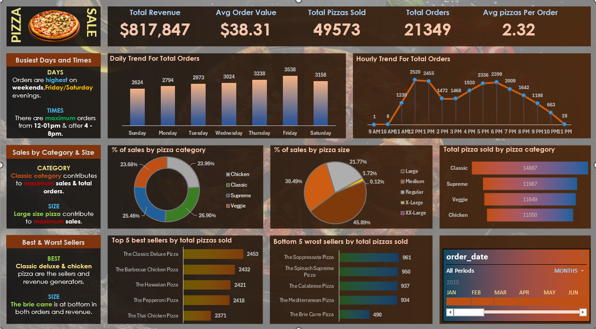

# 🍕 Pizza Sales Dashboard (Excel Only)

## 📌 Project Overview
This project is an **interactive Pizza Sales Dashboard created using Microsoft Excel only**.
The dashboard provides insights into sales performance, customer ordering behavior,
and best/worst selling pizzas.

> ❌ No Power BI  
> ❌ No Tableau  
> ✅ Excel Only

---

## 🛠 Tools & Technologies Used
- Microsoft Excel
- Pivot Tables
- Pivot Charts
- Excel Formulas
- Slicers
- Data Cleaning & Data Processing

---

## 📊 Key KPIs
- Total Revenue
- Total Orders
- Average Order Value
- Total Pizzas Sold
- Average Pizzas per Order

---

## 📈 Dashboard Visualizations
- Daily Trend for Total Orders
- Hourly Trend for Total Orders
- % of Sales by Pizza Category
- % of Sales by Pizza Size
- Total Pizzas Sold by Category
- Top 5 Best Sellers
- Bottom 5 Worst Sellers

---

## 📷 Dashboard Preview

---

## 📊 Trend Analysis

### Daily Trend

### Hourly Trend

---

## 🔍 Key Insights
- Orders are highest on **Friday and Saturday evenings**
- Peak order times are:
  - **12 PM – 1 PM**
  - **4 PM – 8 PM**
- **Classic category** contributes the maximum sales
- **Large size pizzas** generate the highest revenue
- *The Brie Carre Pizza* is the lowest performing product

---

## 📁 Project Folder Structure
